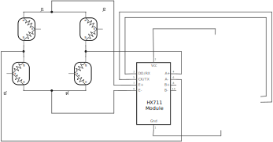

# outdoor_scales

a simple outdoor scales using 4 x load cells combined with an HX711 and a Particle Photon to route data to the cloud.

## TODO

1. add temperature sensor
2. add calibration + store that in cloud
3. send measurement data (temp, weight) to cloud
4. design PCB, build PCB
5. decide on power source
6. put in waterproof box
7. build physical scales

## Particle / Arduino code

This code is designed to run on the Particle Photon device and the code is all in the [particle](particle) subfolder. It makes use of the great HX711ADC library from <https://github.com/eliteio/HX711ADC/>

It assumes:

- HX711 DOUT / DT is connected to pin D3
- HX711 SCK is connected to pin D2

The LED blinks every time a reading is taken.

## Load cells

Each load sensor has 3 wires, arranged roughly as:


The idea is that by measuring the change in resistance you can measure the weight.

There is no formal standard for which colour is which wire, but there appears to be a rough convention, although the only way is to measure the resistance across the three combinations - one set will produce a value roughly double that of the other two.

| colour | meaning |
| ------ | ------- |
| Black  | +       |
| Red    | C       |
| White  | -       |

The load sensors need to be connected together to form a [Wheatstone Bridge](https://www.hbm.com/en/7163/wheatstone-bridge-circuit/). Connecting 4 load cells is relatively simple - the schematic is below. :


### Load Sensor Combinator

I did try reverse engineering the open source [SparkFun Load Sensor Combinator](https://www.sparkfun.com/products/13878)), which results in the following:

| source           | end              |
| ---------------- | ---------------- |
| - of upper left  | - of lower left  |
| - of upper right | - of lower right |
| + of upper left  | + of upper right |
| + of lower left  | + of lower right |

This gives you the following outputs:

| connection       | output |
| ---------------- | ------ |
| C of upper left  | E+     |
| C of upper right | A+     |
| C of lower left  | A-     |
| C of lower right | E-     |

however this gave readings which weren't particualy stable.

### final wiring diagram



## Getting device-to-cloud data streams

The particle device uses the [Particle.publish()](https://docs.particle.io/reference/device-os/firmware/photon/#particle-publish-) API to publish events to the particle cloud using the `average/units` and `average/values` event IDs. Because I dont `scale.tare()` the scale, and i don't `scale.set_units(n)` the two are approximately the same. This means i can reboot the device and still receive the "raw" reading from it, and tare and scale the values in the cloud.

### Particle to Azure IOT Hub

I created an [Azure IOT hub](https://azure.microsoft.com/en-gb/services/iot-hub/), and enabled the [OOTB integration between particle.io and Azure](https://docs.particle.io/tutorials/integrations/azure-iot-hub/) for events with the prefix `average/`. To achieve this I had to add some additional properties, so I'm using the following custom json:

```json
{
  "source": "particle.io",
  "type": "cloud_scales",
  "name": "cloud_scales",
  "event": "{{{PARTICLE_EVENT_NAME}}}",
  "data": "{{{PARTICLE_EVENT_VALUE}}}",
  "device_id": "{{{PARTICLE_DEVICE_ID}}}",
  "published_at": "{{{PARTICLE_PUBLISHED_AT}}}"
}
```

### Azure IOT hub to Azure Event hub

I created an [IOT hub custom routing rule](https://docs.microsoft.com/en-us/azure/iot-hub/iot-hub-devguide-messages-read-custom) to send all events with the type `cloud_scales`:

```sql
$body.type='cloud_scales'
```

### Event hub to SQL DB

i decided to store the data in to a SQL database. I'm creating an Azure Function which

- I'm using the [smallest DTU-based DB with 5 DTUs](https://azure.microsoft.com/en-gb/pricing/details/sql-database/single/).
- Create a `my_db_owner` group in AAD, and then [enable AAD integration](https://docs.microsoft.com/en-us/azure/sql-database/sql-database-aad-authentication-configure?tabs=azure-powershell).
- [create an SPN for RBAC](https://docs.microsoft.com/en-us/cli/azure/create-an-azure-service-principal-azure-cli?view=azure-cli-latest) in AAD using the az cli: `az ad sp create-for-rbac --name cloud_sql_spn` and make a note of the password and appID.
- Grant that SPN `db_datawriter` and `db_datareader` access to the DB:

```SQL
EXEC sp_addrolemember 'db_datawriter', 'cloud_sql_spn'
EXEC sp_addrolemember 'db_datareader', 'cloud_sql_spn'
```

The database has a relatively simple structure:

```SQL
-- This script only contains the table creation statements and does not fully represent the table in the database. It's still missing: sequences, indices, triggers. Do not use it as a backup.

CREATE TABLE [dbo].[cloud_scales_source_data] (
    [id] bigint,
    [source] varchar,
    [type] varchar,
    [name] varchar,
    [event] varchar,
    [data] decimal,
    [device_id] varchar,
    [published_at] datetime,
    PRIMARY KEY ([id])
);
```

