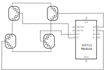

# outdoor_scales

a simple outdoor scales using 4 x load cells combined with an HX711 and a Particle Photon to route data to the cloud.

## TODO
1. add temperature sensor
2. add calibration + store that in cloud
3. send measurement data (temp, weight) to cloud
4. design PCB, build PCB
5. decide on power source
6. put in waterproof box
7. build physical scales

## Particle / Arduino code

This code is designed to run on the Particle Photon device. It makes use of the great HX711ADC library from <https://github.com/eliteio/HX711ADC/>

It assumes:

- HX711 DOUT / DT is connected to pin D3
- HX711 SCK is connected to pin D2

The LED blinks every time a reading is taken.

## wiring

Each load sensor has 3 wires, arranged roughly as:

There is no formal standard for which colour is which wire - the only way is to measure the resistance across the three combinations - one set will produce a value roughly double that of the other two. In my testing, I found the following colours relatively consistently:

| colour | meaning |
|--|--|
| Black | + |
| Red | C |
| White | - |

The load sensors need to be connected together to form a [Wheatstone Bridge](https://www.hbm.com/en/7163/wheatstone-bridge-circuit/). Connecting 4 load cells is relatively simple - the schematic is below. Basically connect these (reversed engineered from the open source [SparkFun Load Sensor Combinator](https://www.sparkfun.com/products/13878)):

| source | end |
|--|--|
| - of upper left | - of lower left |
| - of upper right | - of lower right |
| + of upper left | + of upper right |
| + of lower left | + of lower right |

This gives you the following outputs:

| connection | output |
|--|--|
| C of upper left | E+ |
| C of upper right | A+ |
| C of lower left | A- |
| C of lower right | E- |

Connect the HX711 to the Arduino/Photon as outlined above.